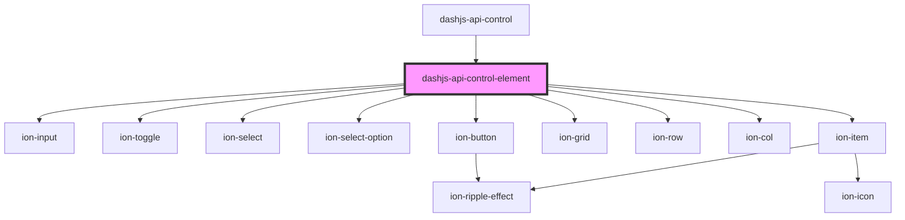

# dashjs-api-control-element

<!-- Auto Generated Below -->

## Properties

| Property    | Attribute    | Description                                | Type                                                                                                                                                | Default     |
| ----------- | ------------ | ------------------------------------------ | --------------------------------------------------------------------------------------------------------------------------------------------------- | ----------- |
| `name`      | `name`       | The displayed name of the control element. | `string`                                                                                                                                            | `undefined` |
| `options`   | --           |                                            | `string[]`                                                                                                                                          | `undefined` |
| `param`     | `param`      |                                            | `any`                                                                                                                                               | `undefined` |
| `paramDesc` | `param-desc` |                                            | `any`                                                                                                                                               | `undefined` |
| `type`      | `type`       |                                            | `Type.HTML5MediaElement \| Type.MediaType \| Type.boolean \| Type.function \| Type.number \| Type.object \| Type.string \| Type.value \| Type.void` | `undefined` |

## Events

| Event          | Description | Type               |
| -------------- | ----------- | ------------------ |
| `valueChanged` |             | `CustomEvent<any>` |

## Dependencies

### Used by

 - [dashjs-api-control](../dashjs-api-control)

### Depends on

- ion-input
- ion-toggle
- ion-select
- ion-select-option
- ion-button
- ion-grid
- ion-row
- ion-col
- ion-item

### Graph

----------------------------------------------

*Built with [StencilJS](https://stenciljs.com/)*
