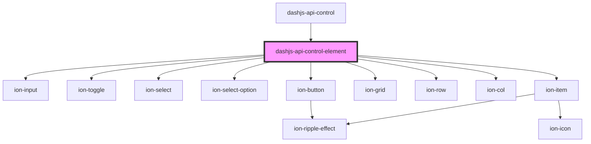

# dashjs-api-control-element

<!-- Auto Generated Below -->

## Properties

| Property | Attribute | Description                                             | Type     | Default     |
| -------- | --------- | ------------------------------------------------------- | -------- | ----------- |
| `name`   | `name`    | The displayed name of the control element.              | `string` | `undefined` |
| `param`  | `param`   | Contains the required parameters of the control element | `any`    | `undefined` |

## Events

| Event          | Description                    | Type               |
| -------------- | ------------------------------ | ------------------ |
| `callFunction` | Triggers the API call function | `CustomEvent<any>` |

## Dependencies

### Used by

 - [dashjs-api-control](../dashjs-api-control)

### Depends on

- ion-input
- ion-toggle
- ion-select
- ion-select-option
- ion-button
- ion-grid
- ion-row
- ion-col
- ion-item

### Graph

----------------------------------------------

*Built with [StencilJS](https://stenciljs.com/)*
