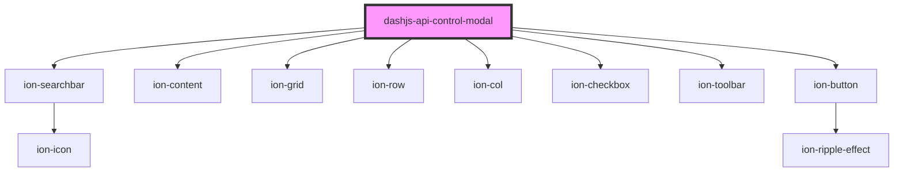

# dashjs-api-control-modal

<!-- Auto Generated Below -->

## Properties

| Property            | Attribute | Description | Type               | Default     |
| ------------------- | --------- | ----------- | ------------------ | ----------- |
| `functionList`      | --        |             | `DashFunction[]`   | `[]`        |
| `selectedFunctions` | --        |             | `Map<string, any>` | `new Map()` |

## Dependencies

### Depends on

- ion-searchbar
- ion-content
- ion-grid
- ion-row
- ion-col
- ion-checkbox
- ion-toolbar
- ion-button

### Graph

----------------------------------------------

*Built with [StencilJS](https://stenciljs.com/)*
