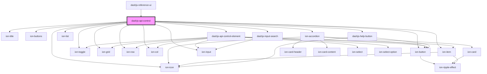

# dashjs-api-control

<!-- Auto Generated Below -->

## Properties

| Property  | Attribute | Description                                       | Type     | Default                 |
| --------- | --------- | ------------------------------------------------- | -------- | ----------------------- |
| `version` | `version` | The version of which the dashjs should be loaded. | `string` | `DASHJS_PLAYER_VERSION` |

## Events

| Event         | Description                  | Type               |
| ------------- | ---------------------------- | ------------------ |
| `playerEvent` | Emits an event to the player | `CustomEvent<any>` |

## Dependencies

### Used by

 - [dashjs-reference-ui](../dashjs-reference-ui)

### Depends on

- ion-title
- ion-buttons
- ion-button
- [ion-accordion](../ion-accordion)
- ion-toggle
- ion-grid
- ion-row
- ion-col
- ion-icon
- ion-item
- ion-input
- ion-list
- [dashjs-api-control-element](../dashjs-api-control-element)
- [dashjs-help-button](../dashjs-help-button)
- [dashjs-input-search](../dashjs-input-search)

### Graph

----------------------------------------------

*Built with [StencilJS](https://stenciljs.com/)*
