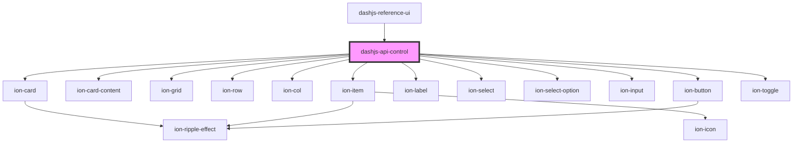

# dashjs-api-control

<!-- Auto Generated Below -->

## Events

| Event         | Description | Type                  |
| ------------- | ----------- | --------------------- |
| `playerEvent` |             | `CustomEvent<String>` |

## Dependencies

### Used by

 - [dashjs-reference-ui](../dashjs-reference-ui)

### Depends on

- ion-card
- ion-card-content
- ion-grid
- ion-row
- ion-col
- ion-item
- ion-label
- ion-select
- ion-select-option
- ion-input
- ion-button
- ion-toggle

### Graph

----------------------------------------------

*Built with [StencilJS](https://stenciljs.com/)*
