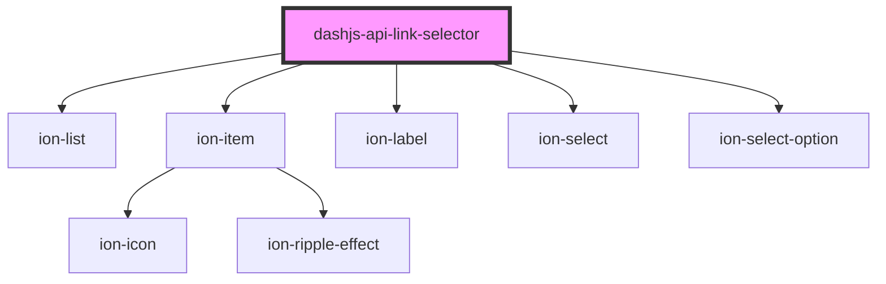

# dashjs-api-control

<!-- Auto Generated Below -->

## Properties

| Property     | Attribute | Description | Type    | Default     |
| ------------ | --------- | ----------- | ------- | ----------- |
| `sourceList` | --        |             | `any[]` | `undefined` |

## Events

| Event       | Description | Type                  |
| ----------- | ----------- | --------------------- |
| `setStream` |             | `CustomEvent<string>` |

## Dependencies

### Depends on

- ion-list
- ion-item
- ion-label
- ion-select
- ion-select-option

### Graph

----------------------------------------------

*Built with [StencilJS](https://stenciljs.com/)*
