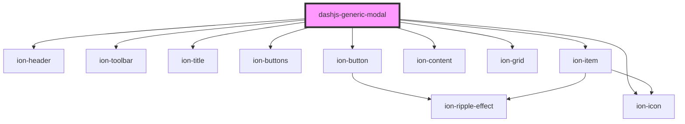

# dashjs-generic-modal

<!-- Auto Generated Below -->

## Properties

| Property    | Attribute    | Description                                                       | Type                    | Default     |
| ----------- | ------------ | ----------------------------------------------------------------- | ----------------------- | ----------- |
| `content`   | `content`    | Content displayed inside the modal, can be text or an HTMLElement | `HTMLElement \| string` | `undefined` |
| `textTitle` | `text-title` | Title displayed on Top of the Modal                               | `string`                | `''`        |

## Dependencies

### Depends on

- ion-header
- ion-toolbar
- ion-title
- ion-buttons
- ion-button
- ion-icon
- ion-content
- ion-grid
- ion-item

### Graph

----------------------------------------------

*Built with [StencilJS](https://stenciljs.com/)*
