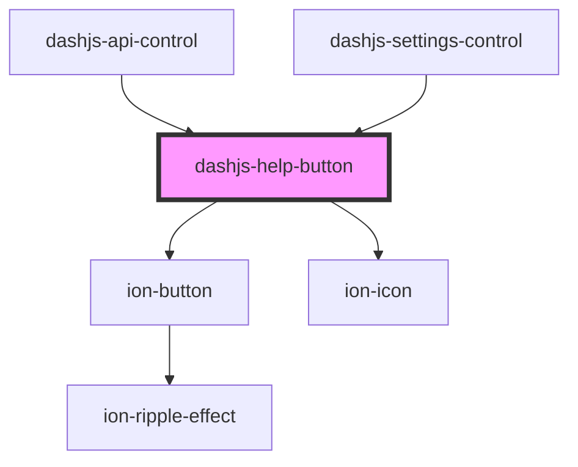

# dashjs-help-button

<!-- Auto Generated Below -->

## Properties

| Property     | Attribute     | Description                                         | Type                  | Default     |
| ------------ | ------------- | --------------------------------------------------- | --------------------- | ----------- |
| `helperText` | `helper-text` | Informational text displayed in the Modal for help. | `string`              | `''`        |
| `titleText`  | `title-text`  | title displayed on top of the Modal.                | `string \| undefined` | `undefined` |

## Dependencies

### Used by

 - [dashjs-api-control](../dashjs-api-control)
 - [dashjs-settings-control](../dashjs-settings-control)

### Depends on

- ion-button
- ion-icon

### Graph

----------------------------------------------

*Built with [StencilJS](https://stenciljs.com/)*
