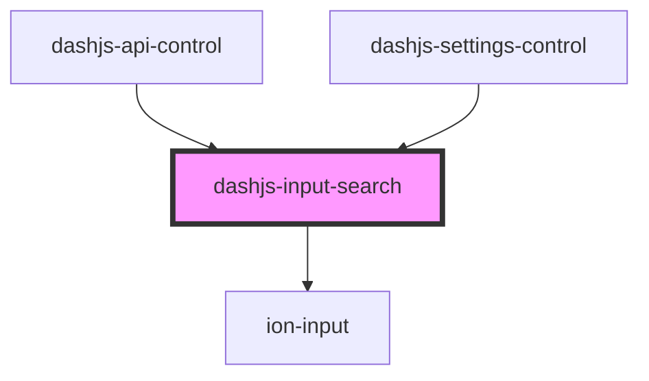

# dashjs-input-search

<!-- Auto Generated Below -->

## Properties

| Property          | Attribute     | Description                                                                  | Type                      | Default      |
| ----------------- | ------------- | ---------------------------------------------------------------------------- | ------------------------- | ------------ |
| `displayFunction` | --            | Function applied before display of the Search Item                           | `(str: string) => string` | `str => str` |
| `placeholder`     | `placeholder` | Placholder of the input element                                              | `string`                  | `''`         |
| `searchItemList`  | --            | List of searched Items, single one will be emitted if selected during search | `string[]`                | `[]`         |

## Events

| Event                | Description                                      | Type                  |
| -------------------- | ------------------------------------------------ | --------------------- |
| `searchItemSelected` | Search Item that was selected during the search. | `CustomEvent<string>` |

## Dependencies

### Used by

 - [dashjs-api-control](../dashjs-api-control)
 - [dashjs-settings-control](../dashjs-settings-control)

### Depends on

- ion-input

### Graph

----------------------------------------------

*Built with [StencilJS](https://stenciljs.com/)*
