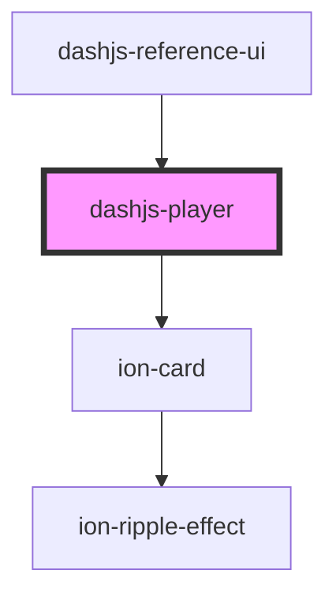

# dashjs-player

<!-- Auto Generated Below -->

## Properties

| Property    | Attribute    | Description | Type     | Default                                                       |
| ----------- | ------------ | ----------- | -------- | ------------------------------------------------------------- |
| `streamUrl` | `stream-url` |             | `string` | `undefined`                                                   |
| `url`       | `url`        |             | `string` | `'https://dash.akamaized.net/akamai/bbb_30fps/bbb_30fps.mpd'` |

## Dependencies

### Used by

 - [dashjs-reference-ui](../dashjs-reference-ui)

### Depends on

- ion-card

### Graph

----------------------------------------------

*Built with [StencilJS](https://stenciljs.com/)*
