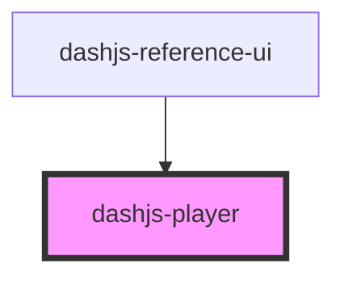

# dashjs-player

<!-- Auto Generated Below -->

## Properties

| Property   | Attribute | Description                                                 | Type                      | Default                 |
| ---------- | --------- | ----------------------------------------------------------- | ------------------------- | ----------------------- |
| `settings` | --        | The Settings of dashjs that should be used. e.g. v3.2.0     | `MediaPlayerSettingClass` | `{}`                    |
| `type`     | `type`    | The Type of dashjs that should be loaded. e.g. debug or min | `string`                  | `DASHJS_PLAYER_TYPE`    |
| `version`  | `version` | The Version of dashjs that should be loaded. e.g. v3.2.0    | `string`                  | `DASHJS_PLAYER_VERSION` |

## Events

| Event                | Description | Type               |
| -------------------- | ----------- | ------------------ |
| `playerEvent`        |             | `CustomEvent<any>` |
| `playerResponse`     |             | `CustomEvent<any>` |
| `streamMetricsEvent` |             | `CustomEvent<any>` |

## Dependencies

### Used by

 - [dashjs-reference-ui](../dashjs-reference-ui)

### Graph

----------------------------------------------

*Built with [StencilJS](https://stenciljs.com/)*
