# dashjs-reference-ui

<!-- Auto Generated Below -->

## Properties

| Property | Attribute | Description | Type     | Default     |
| -------- | --------- | ----------- | -------- | ----------- |
| `url`    | `url`     |             | `string` | `undefined` |

## Dependencies

### Depends on

- [dashjs-api-control](../dashjs-api-control)
- [dashjs-settings-control](../dashjs-settings-control)
- [dashjs-player](../dashjs-player)
- [dashjs-statistics](../dashjs-statistics)

### Graph

```mermaid
graph TD;
  dashjs-reference-ui --> dashjs-api-control
  dashjs-reference-ui --> dashjs-settings-control
  dashjs-reference-ui --> dashjs-player
  dashjs-reference-ui --> dashjs-statistics
  dashjs-api-control --> ion-card
  dashjs-api-control --> ion-card-content
  dashjs-api-control --> ion-grid
  dashjs-api-control --> ion-row
  dashjs-api-control --> ion-col
  dashjs-api-control --> ion-item
  dashjs-api-control --> ion-label
  dashjs-api-control --> ion-select
  dashjs-api-control --> ion-select-option
  dashjs-api-control --> ion-input
  dashjs-api-control --> ion-button
  dashjs-api-control --> ion-toggle
  ion-card --> ion-ripple-effect
  ion-item --> ion-icon
  ion-item --> ion-ripple-effect
  ion-button --> ion-ripple-effect
  dashjs-settings-control --> ion-card
  dashjs-settings-control --> ion-card-header
  dashjs-settings-control --> ion-card-title
  dashjs-settings-control --> ion-card-content
  dashjs-settings-control --> ion-grid
  dashjs-settings-control --> ion-row
  dashjs-settings-control --> ion-chip
  dashjs-settings-control --> ion-label
  dashjs-settings-control --> ion-icon
  dashjs-settings-control --> ion-button
  dashjs-settings-control --> ion-list
  dashjs-settings-control --> dashjs-settings-control-element
  ion-chip --> ion-ripple-effect
  dashjs-settings-control-element --> ion-item
  dashjs-settings-control-element --> ion-label
  dashjs-settings-control-element --> ion-select
  dashjs-settings-control-element --> ion-select-option
  dashjs-settings-control-element --> ion-input
  dashjs-settings-control-element --> ion-toggle
  dashjs-player --> ion-card
  dashjs-statistics --> ion-card
  dashjs-statistics --> ion-card-header
  dashjs-statistics --> ion-card-title
  dashjs-statistics --> ion-grid
  dashjs-statistics --> ion-row
  dashjs-statistics --> ion-col
  dashjs-statistics --> ion-title
  dashjs-statistics --> ion-item
  dashjs-statistics --> ion-label
  dashjs-statistics --> ion-checkbox
  dashjs-statistics --> ion-item-divider
  dashjs-statistics --> ion-card-content
  dashjs-statistics --> ion-button
  style dashjs-reference-ui fill:#f9f,stroke:#333,stroke-width:4px
```

----------------------------------------------

*Built with [StencilJS](https://stenciljs.com/)*
