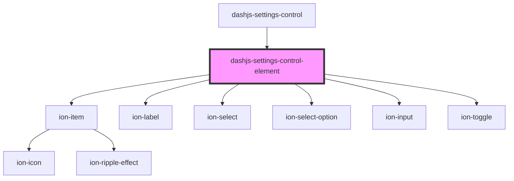

# dashjs-settings-control-element

<!-- Auto Generated Below -->

## Properties

| Property       | Attribute       | Description | Type                                                                      | Default     |
| -------------- | --------------- | ----------- | ------------------------------------------------------------------------- | ----------- |
| `defaultValue` | `default-value` |             | `any`                                                                     | `undefined` |
| `name`         | `name`          |             | `string`                                                                  | `undefined` |
| `options`      | --              |             | `string[]`                                                                | `undefined` |
| `type`         | `type`          |             | `Type.boolean \| Type.group \| Type.number \| Type.object \| Type.string` | `undefined` |

## Events

| Event          | Description | Type               |
| -------------- | ----------- | ------------------ |
| `valueChanged` |             | `CustomEvent<any>` |

## Dependencies

### Used by

 - [dashjs-settings-control](../dashjs-settings-control)

### Depends on

- ion-item
- ion-label
- ion-select
- ion-select-option
- ion-input
- ion-toggle

### Graph

----------------------------------------------

*Built with [StencilJS](https://stenciljs.com/)*
