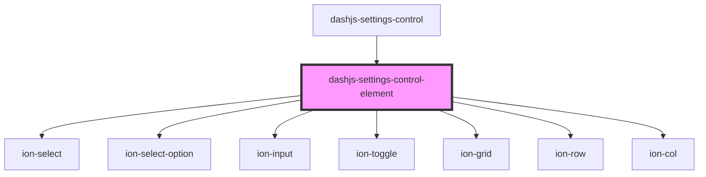

# dashjs-settings-control-element

<!-- Auto Generated Below -->

## Properties

| Property        | Attribute       | Description                                                                                                         | Type                                                                                                                                                | Default     |
| --------------- | --------------- | ------------------------------------------------------------------------------------------------------------------- | --------------------------------------------------------------------------------------------------------------------------------------------------- | ----------- |
| `defaultValue`  | `default-value` | The default value of the Setting                                                                                    | `boolean \| number \| string \| undefined`                                                                                                          | `undefined` |
| `name`          | `name`          | Displayed name of the Setting                                                                                       | `string`                                                                                                                                            | `undefined` |
| `options`       | --              | A Select with the specified options will be displayed if supplied.                                                  | `string[]`                                                                                                                                          | `undefined` |
| `optionsLabels` | --              | Optional: Labels that are displayed intead of the options value. Labels are displayed in the same order as options. | `string[] \| undefined`                                                                                                                             | `undefined` |
| `type`          | `type`          | The Type of the Settings Control which should be displayed, e.g. 'number'                                           | `Type.HTML5MediaElement \| Type.MediaType \| Type.boolean \| Type.function \| Type.number \| Type.object \| Type.string \| Type.value \| Type.void` | `undefined` |

## Events

| Event          | Description                                          | Type                                                    |
| -------------- | ---------------------------------------------------- | ------------------------------------------------------- |
| `valueChanged` | The value of the Settings wil be emitted if changed. | `CustomEvent<boolean \| number \| string \| undefined>` |

## Dependencies

### Used by

 - [dashjs-settings-control](../dashjs-settings-control)

### Depends on

- ion-select
- ion-select-option
- ion-input
- ion-toggle
- ion-grid
- ion-row
- ion-col

### Graph

----------------------------------------------

*Built with [StencilJS](https://stenciljs.com/)*
