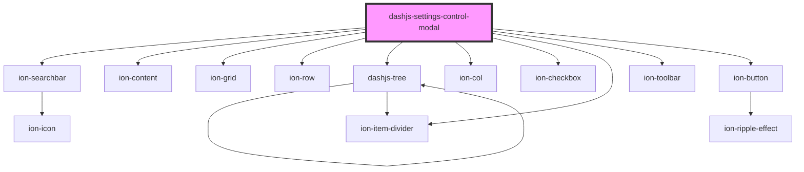

# dashjs-settings-control-modal

<!-- Auto Generated Below -->

## Properties

| Property           | Attribute | Description | Type                            | Default     |
| ------------------ | --------- | ----------- | ------------------------------- | ----------- |
| `selectedSettings` | --        |             | `Map<string, SettingsMapValue>` | `new Map()` |
| `settingsList`     | --        |             | `Setting[]`                     | `[]`        |
| `settingsTree`     | --        |             | `Tree \| undefined`             | `undefined` |

## Dependencies

### Depends on

- ion-searchbar
- ion-content
- ion-grid
- ion-row
- [dashjs-tree](../dashjs-tree)
- ion-col
- ion-checkbox
- ion-item-divider
- ion-toolbar
- ion-button

### Graph

----------------------------------------------

*Built with [StencilJS](https://stenciljs.com/)*
