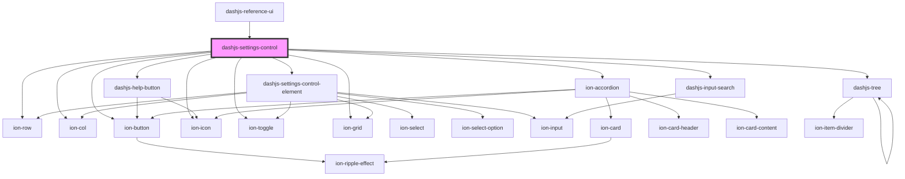

# dashjs-settings-control

<!-- Auto Generated Below -->

## Properties

| Property  | Attribute | Description                                         | Type                  | Default     |
| --------- | --------- | --------------------------------------------------- | --------------------- | ----------- |
| `version` | `version` | The version of which the settings should be loaded. | `string \| undefined` | `undefined` |

## Events

| Event             | Description                                | Type                                   |
| ----------------- | ------------------------------------------ | -------------------------------------- |
| `settingsUpdated` | Emitted everytime the Settings are updated | `CustomEvent<MediaPlayerSettingClass>` |

## Methods

### `resetSettings() => Promise<void>`

Resets the internal Settings

#### Returns

Type: `Promise<void>`

## Dependencies

### Used by

 - [dashjs-reference-ui](../dashjs-reference-ui)

### Depends on

- ion-row
- ion-col
- ion-button
- ion-icon
- [dashjs-settings-control-element](../dashjs-settings-control-element)
- [dashjs-help-button](../dashjs-help-button)
- [ion-accordion](../ion-accordion)
- ion-toggle
- ion-grid
- [dashjs-tree](../dashjs-tree)
- [dashjs-input-search](../dashjs-input-search)

### Graph

----------------------------------------------

*Built with [StencilJS](https://stenciljs.com/)*
