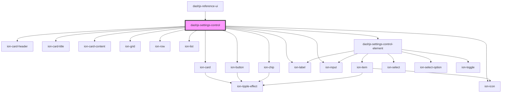

# dashjs-settings-control

<!-- Auto Generated Below -->

## Properties

| Property  | Attribute | Description | Type            | Default     |
| --------- | --------- | ----------- | --------------- | ----------- |
| `history` | --        |             | `RouterHistory` | `undefined` |

## Events

| Event             | Description | Type                  |
| ----------------- | ----------- | --------------------- |
| `settingsUpdated` |             | `CustomEvent<Object>` |

## Methods

### `resetSettings() => Promise<void>`

Test

#### Returns

Type: `Promise<void>`

## Dependencies

### Used by

 - [dashjs-reference-ui](../dashjs-reference-ui)

### Depends on

- ion-card
- ion-card-header
- ion-card-title
- ion-button
- ion-icon
- ion-card-content
- ion-grid
- ion-row
- ion-chip
- ion-label
- ion-input
- ion-list
- [dashjs-settings-control-element](../dashjs-settings-control-element)

### Graph

----------------------------------------------

*Built with [StencilJS](https://stenciljs.com/)*
