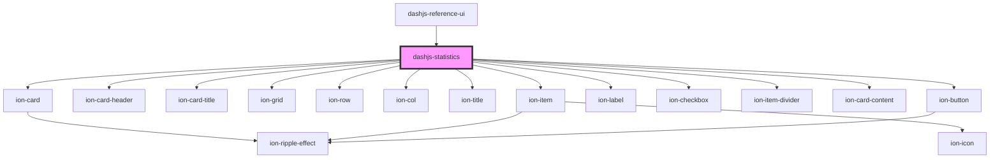

# dashjs-statistics

<!-- Auto Generated Below -->

## Properties

| Property        | Attribute        | Description | Type  | Default     |
| --------------- | ---------------- | ----------- | ----- | ----------- |
| `audio_data`    | `audio_data`     |             | `any` | `undefined` |
| `videoInstance` | `video-instance` |             | `any` | `undefined` |
| `video_data`    | `video_data`     |             | `any` | `undefined` |

## Dependencies

### Used by

 - [dashjs-reference-ui](../dashjs-reference-ui)

### Depends on

- ion-card
- ion-card-header
- ion-card-title
- ion-grid
- ion-row
- ion-col
- ion-title
- ion-item
- ion-label
- ion-checkbox
- ion-item-divider
- ion-card-content
- ion-button

### Graph

----------------------------------------------

*Built with [StencilJS](https://stenciljs.com/)*
