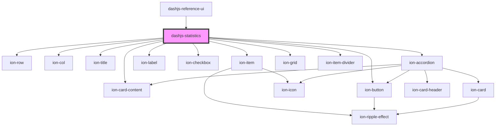

# dashjs-statistics

<!-- Auto Generated Below -->

## Dependencies

### Used by

 - [dashjs-reference-ui](../dashjs-reference-ui)

### Depends on

- ion-row
- ion-col
- ion-title
- ion-item
- ion-label
- ion-checkbox
- ion-card-content
- ion-button
- [ion-accordion](../ion-accordion)
- ion-grid
- ion-item-divider

### Graph

----------------------------------------------

*Built with [StencilJS](https://stenciljs.com/)*
