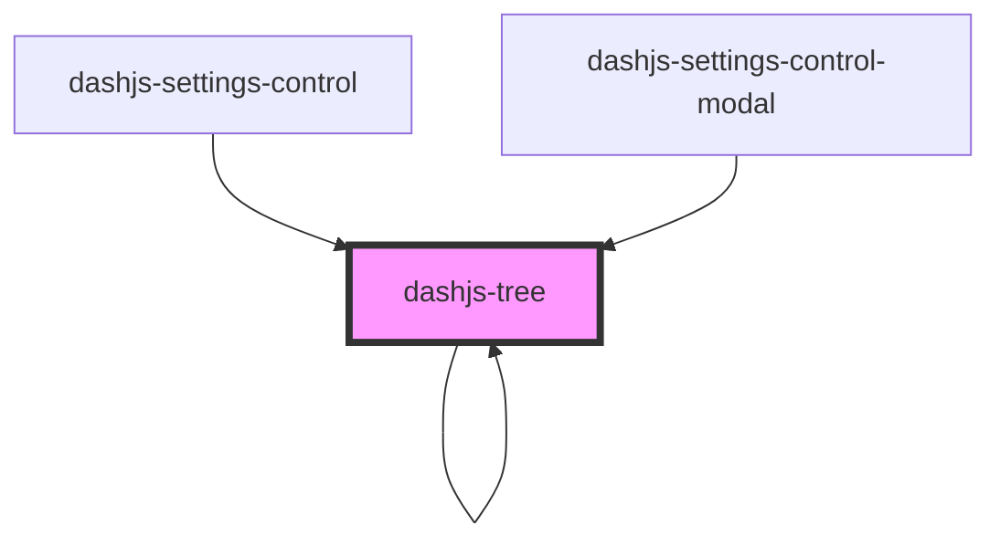

# dashjs-tree

<!-- Auto Generated Below -->

## Properties

| Property           | Attribute | Description                                           | Type                    | Default     |
| ------------------ | --------- | ----------------------------------------------------- | ----------------------- | ----------- |
| `elements`         | --        | All Elements (for data access)                        | `string[]`              | `undefined` |
| `path`             | --        | States the current path for orientation               | `string[]`              | `[]`        |
| `renderFunc`       | --        | Functions which renders the elements of this node     | `(key: string) => void` | `undefined` |
| `renderFuncSuffix` | --        | Function which state whether the element has a suffix | `() => void`            | `undefined` |
| `renderFuncTitle`  | --        | Functions which renders the the title of this node    | `(path: any) => void`   | `undefined` |
| `root`             | `root`    | Fill if this is the root of the Tree                  | `boolean`               | `false`     |
| `tree`             | --        | The Tree Element which is the current root.           | `Tree`                  | `undefined` |

## Dependencies

### Used by

 - [dashjs-settings-control](../dashjs-settings-control)
 - [dashjs-settings-control-modal](../dashjs-settings-control-modal)
 - [dashjs-tree](.)

### Depends on

- [dashjs-tree](.)
- ion-item-divider

### Graph

----------------------------------------------

*Built with [StencilJS](https://stenciljs.com/)*
