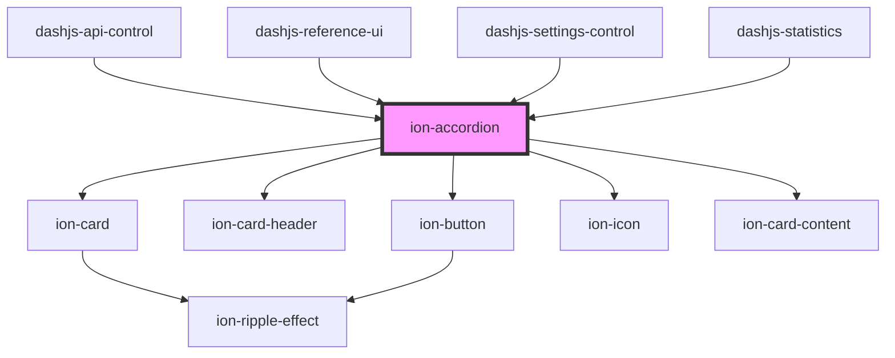

# ion-accordion

<!-- Auto Generated Below -->

## Properties

| Property    | Attribute    | Description                                    | Type     | Default |
| ----------- | ------------ | ---------------------------------------------- | -------- | ------- |
| `titleText` | `title-text` | The Title of the accordion. Can be left blank. | `string` | `''`    |

## Methods

### `setExpandState(state: boolean) => Promise<void>`

Set the expansion State

#### Returns

Type: `Promise<void>`

## Dependencies

### Used by

 - [dashjs-api-control](../dashjs-api-control)
 - [dashjs-reference-ui](../dashjs-reference-ui)
 - [dashjs-settings-control](../dashjs-settings-control)
 - [dashjs-statistics](../dashjs-statistics)

### Depends on

- ion-card
- ion-card-header
- ion-button
- ion-icon
- ion-card-content

### Graph

----------------------------------------------

*Built with [StencilJS](https://stenciljs.com/)*
